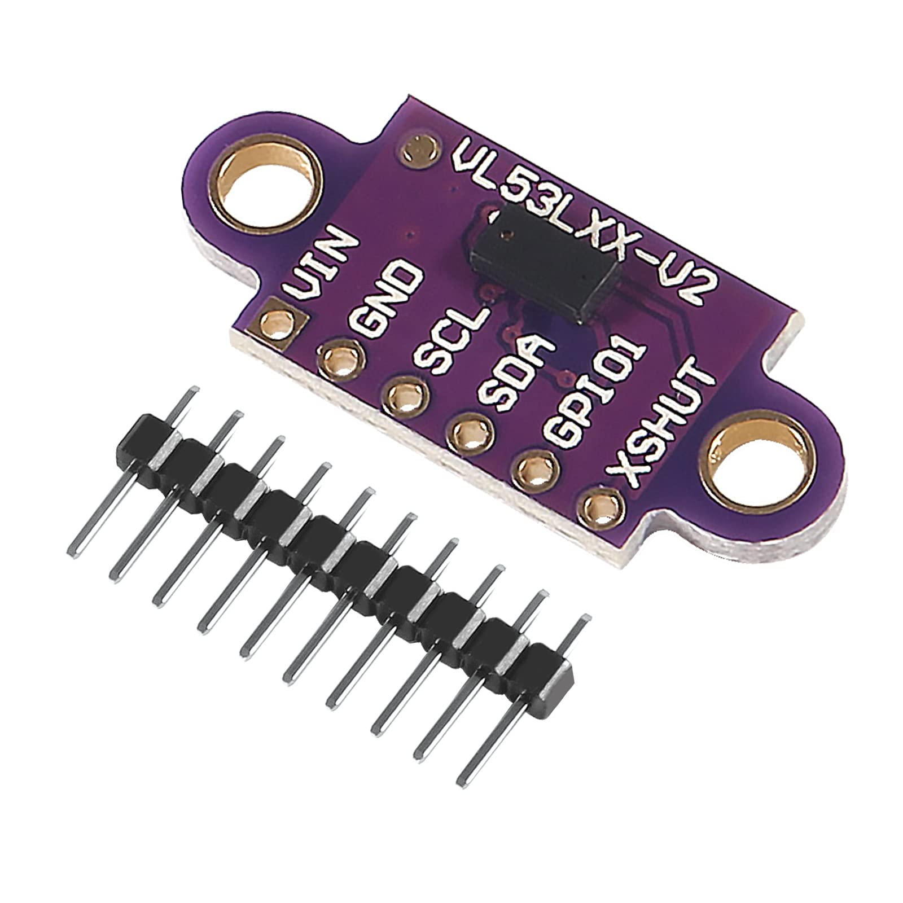

# VL53L0X Time-of-Flight Distance Sensor

Demo for VL53L0X Time-of-Flight Distance Sensor

<picture>
  
</picture>

Watch the implementation of this code on our [YouTube channel](https://www.youtube.com/@Roboticxps)

To get your own VL53L0X Time-of-Flight Distance Sensor, visit our online store: (Product Page)

https://roboticx.ps/product/cjvl53l0xv2-laser-ranging-sensor-time-of-flight-tof

----

Follow us on social media:

* Facebook: https://www.facebook.com/Roboticxps
* Instagram: https://www.instagram.com/roboticx.ps
* YouTube: https://www.youtube.com/@Roboticxps
* LinkedIn: https://www.linkedin.com/company/roboticx
